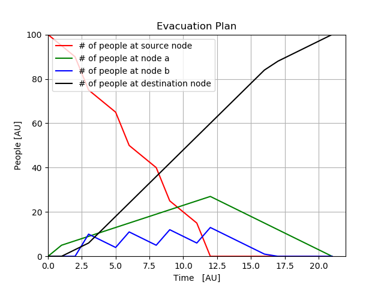
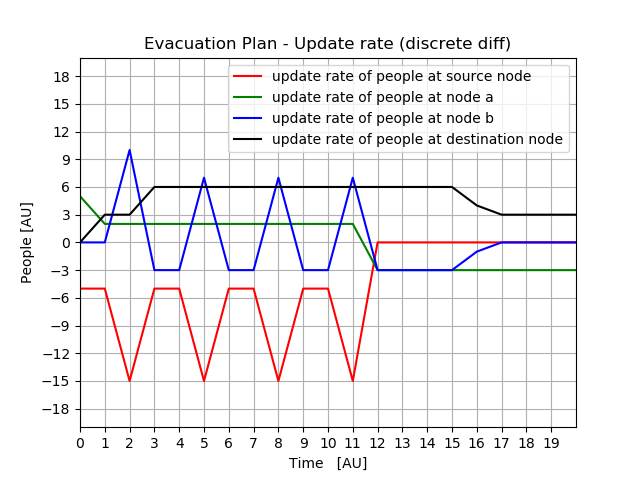

## ex07-08-dynamic-networks-and-transshipment-fernandoorge

### Table of contents
* [Repo organization](#repo-organization)
* [Solution to exercise 07](#solution-to-exercise-07)
* [Solution to exercise 08](#solution-to-exercise-08)
  * [Solution for product A1](#solution-for-product-a1)
  * [Solution for product A2](#solution-for-product-a2)
  * [Solution for both products](#solution-for-both-products)

### Repo organization

Each exercise of the assignment is solved in a different file
* ex07.py for exercise 07
* ex08.py for exercise 08

*basic_utils.py* contains some useful functions developed by the professor.

*logistics.py*  constains some useful functions developed by me. The required 
algorithms to complete the assignment can be found there.


### Solution to exercise 07

```
    1) For the following graph: find the maximum flow from s to t using the scipy.linprog package.
    
     SOLVING PROBLEM WITH: simplex
	 Solution to the problem:
	   The raw solution will be: 
	   [ 6.  6.  3.  3.  0. -0.  5.  1.  5.  1.  3.  0.  3. -0.  0.  0.  2.  3.
         2.  3.  0.  3.  3.  0.  0.  0.  3.  3.  0.  0.  3.  3.  6.  6. 18.]
	   The maximum flow will be: 18.00 
```
	
	   
```
    2) Optional: select and implement an algorithm designed for this particular kind of problems and
    compare the results obtained in 1).
```

The following solution requires more formalization, however it's a simply and a very effective approach.
The main idea behind this approach is to considered the update rate of each node, where the update rate is the amount of people the node can accept at any given time. For instance, node a is able to accept 5 people at any given time, but node b is able to accept 10 people only after 3 units of time.

The arc between node a and node b (a,b) was elimated, becuase it's not relevant for the final solution (this is what needs a formal probe), but the main idea is that in steady state motion, the node t will accept 6 people per unit of time regardless arc (a,b) becuase both nodes a and b are fed with enough people from s.

If we considered a sample case where we want to evacuate 100 people, the solution we found with this approach is shown below. The 4-tuple (s,a,b,t) is printed for every step time in the simulation. The integer values represent the amount of people at each node.

```
                                  ('s','a','b','t')
    state at time  0: (s,a,b,t) = (100,  0,  0,  0)
    state at time  1: (s,a,b,t) = ( 95,  5,  0,  0)
    state at time  2: (s,a,b,t) = ( 90,  7,  0,  3)
    state at time  3: (s,a,b,t) = ( 75,  9, 10,  6)
    state at time  4: (s,a,b,t) = ( 70, 11,  7, 12)
    state at time  5: (s,a,b,t) = ( 65, 13,  4, 18)
    state at time  6: (s,a,b,t) = ( 50, 15, 11, 24)
    state at time  7: (s,a,b,t) = ( 45, 17,  8, 30)
    state at time  8: (s,a,b,t) = ( 40, 19,  5, 36)
    state at time  9: (s,a,b,t) = ( 25, 21, 12, 42)
    state at time 10: (s,a,b,t) = ( 20, 23,  9, 48)
    state at time 11: (s,a,b,t) = ( 15, 25,  6, 54)
    state at time 12: (s,a,b,t) = (  0, 27, 13, 60)
    state at time 13: (s,a,b,t) = (  0, 24, 10, 66)
    state at time 14: (s,a,b,t) = (  0, 21,  7, 72)
    state at time 15: (s,a,b,t) = (  0, 18,  4, 78)
    state at time 16: (s,a,b,t) = (  0, 15,  1, 84)
    state at time 17: (s,a,b,t) = (  0, 12,  0, 88)
    state at time 18: (s,a,b,t) = (  0,  9,  0, 91)
    state at time 19: (s,a,b,t) = (  0,  6,  0, 94)
    state at time 20: (s,a,b,t) = (  0,  3,  0, 97)
    state at time 21: (s,a,b,t) = (  0,  0,  0,100)
```

Here we have a figure, with the same information



* We see that **node a** is accumulating people until s is empty.
* If more than 100 people need to be evacuated, this accumalation might represent a problem, becuase it might be possible that we can't hold that amount of people at node a.
* The same applies to **node b**.

Now, if we took the derivative of each vector, we can see the update rate at each node.



* At time=3, we reached the steady state motion of the system (at least for node t). Since the update rate is equal to 6, we can conclude that **there's no way to evacuate more than 6 people per unit of time**.

### Solution to exercise 08

#### Solution for product A1

```
    SOLVING PROBLEM WITH SIMPLEX
    The raw solution will be: [20.  0. 10.  0. 30.  0. 30. 10. 20.  0.  0.  0.]
       20 units will be moved across P1 --> W1 arc
        0 units will be moved across P1 --> W2 arc
       10 units will be moved across P2 --> W1 arc
        0 units will be moved across P2 --> W2 arc
       30 units will be moved across P3 --> W1 arc
        0 units will be moved across P3 --> W2 arc
       30 units will be moved across W1 --> S1 arc
       10 units will be moved across W1 --> S2 arc
       20 units will be moved across W1 --> S3 arc
        0 units will be moved across W2 --> S1 arc
        0 units will be moved across W2 --> S2 arc
        0 units will be moved across W2 --> S3 arc
    The minimum cost will be: 18000.00
```

*Conclusions*

* Move all units from every plant to warehouse 1.
* Then move all units from Warehouse 1 to every salepoint.
* Since the costs of moving a unit from every plant to any warehouse are equal (i.e. cost(P1, W1) = cost(P1, W2), the algorithm ignores the second warehouse (W2) and gives us a solution where all units are moved to the first warehouse (W1).
* Considering that there's no limitation in warehouse's capacity, this solution is feasible
      
#### Solution for product A2

```
    SOLVING PROBLEM WITH SIMPLEX
    Solution to the problem:
    The raw solution will be: [30.  0. 40.  0. 10.  0. 40. 20. 20.  0.  0.  0.]
       30 units will be moved across P1 --> W1 arc
        0 units will be moved across P1 --> W2 arc
       40 units will be moved across P2 --> W1 arc
        0 units will be moved across P2 --> W2 arc
       10 units will be moved across P3 --> W1 arc
        0 units will be moved across P3 --> W2 arc
       40 units will be moved across W1 --> S1 arc
       20 units will be moved across W1 --> S2 arc
       20 units will be moved across W1 --> S3 arc
        0 units will be moved across W2 --> S1 arc
        0 units will be moved across W2 --> S2 arc
        0 units will be moved across W2 --> S3 arc
    The minimum cost will be: 26000.00
```

*Conclusions*

* Move all units from every plant to warehouse 1.
* Then move all units from Warehouse 1 to every salepoint.
* Since the costs of moving a unit from every plant to any warehouse are equal (i.e. cost(P1, W1) = cost(P1, W2), the algorithm ignores the second warehouse (W2) and gives us a solution where all units are moved to the first warehouse (W1).
* Considering that there's no limitation in warehouse's capacity, this solution is feasible


#### Solution for both products

**The solution for both products can be thought as the linear combination of solution A and solution B, due to the following reasons**:

* The graph of product A1 (or simply A) is completely independant of the graph of product A2 (or B).
* There is no stock limit in the warehouses. The products doest not compite with each other.
